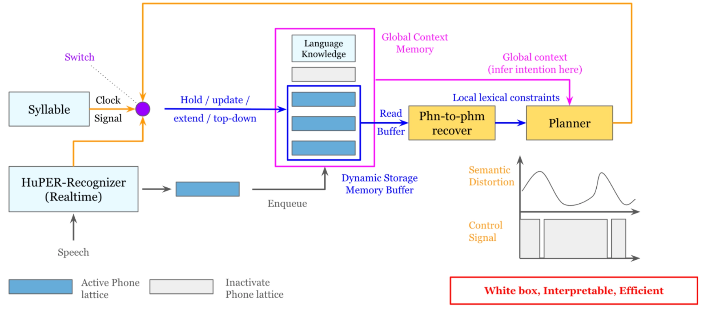
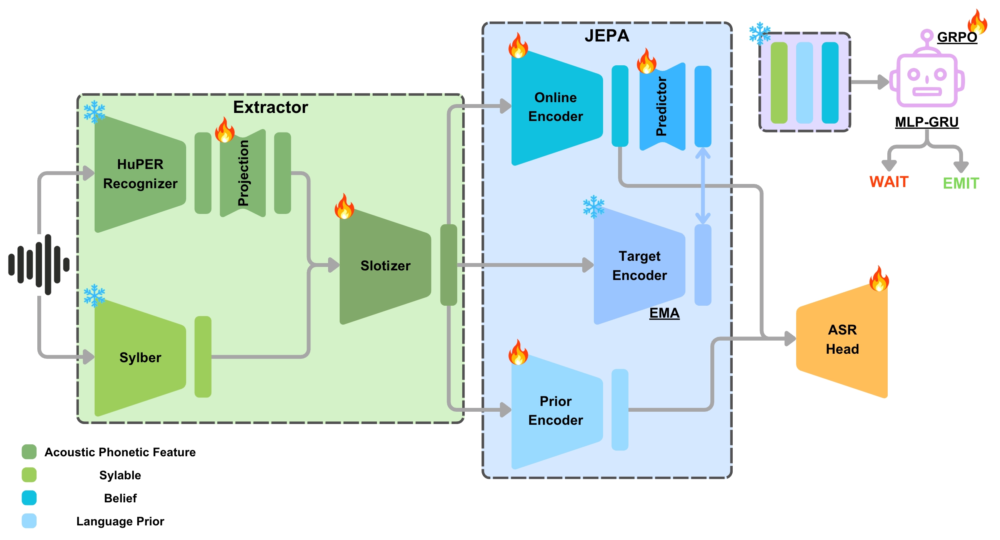

# HuPERWM — Human-Perception-Inspired World Model

HuPERWM models speech perception as iterative Bayesian belief updating. A **Belief World Model** compresses noisy acoustic evidence (HuPER hidden states + Sylber syllable boundaries) into slot-wise *beliefs* and *priors* via Comparison-Refinement. An **Active Agent** then steps through syllable slots and decides *when* to emit each recognised word in a streaming setting.

---

## Overview



The pipeline has two stages:

1. **Belief World Model** — maps frame-level HuPER hidden states to syllable-level beliefs through boundary-gated pooling and iterative Comparison-Refinement. Multiple CTC heads supervise both acoustic evidence and canonical phone sequences.

2. **Active Agent** — a dual-pathway (top-down belief / bottom-up prior+GRU) policy that outputs WAIT / EMIT at each syllable slot. Trained first with imitation learning on oracle labels, then fine-tuned with GRPO + per-step GAE.



---

## Architecture

### Belief World Model

```
Evidence (B, T, 1024)  ← HuPER last hidden states
    └─ evidence_proj (MLP) ──► (B, T, H)
           └─ SyllableSlotPooler (boundary cross-attn + causal slot attn)
                  └─ slots (B, K, H)
                         └─ ComparisonRefinementEncoder
                                ├─ CausalConformer → priors (B, K, H)
                                └─ N × refinement blocks
                                       signed error = belief − prior
                                       gated fusion + Conformer update
                                   → beliefs (B, K, H)
```

**Training losses:** frame-phone CTC + evidence CTC + canonical CTC + future-belief MSE + reconstruction MSE + optional SIGReg / convergence / diversity.

### Active Agent

```
belief  ──► hypothesis_proj ──────────────────► h_top  (B-path: top-down)
prior + syl_feat ──► evidence_encoder ──► GRU ► h_bot  (C-path: bottom-up)
error ──► comparison_gate (sigmoid) ──► gate
h_fused = gate · h_bot + (1 − gate) · h_top
    ├─► policy_head → logits (WAIT / EMIT)
    └─► value_head  → V(s)
```

Low error (belief ≈ prior) → gate ≈ 0 → trust hypothesis → **EMIT**.  
High error (belief ≠ prior) → gate ≈ 1 → gather more evidence → **WAIT**.

---

## Installation

```bash
git clone https://github.com/Wbx0710/HuPERWM.git
cd HuPERWM
conda env create -f environment.yml
conda activate huperwm
```

For CUDA 11.8 GPUs, replace the two `cu124` lines in `environment.yml` with their `cu118` equivalents before running the above.

After activating, download required NLTK data once:

```python
import nltk
nltk.download("cmudict")
```

---

## Data Preparation

The world model expects pre-extracted features stored as per-segment `.pt` files.

### Pre-extracted data on lexi (skip extraction if you have server access)

All features and checkpoints are already available on the **lexi** server under `/data/bixingwu/`. Contact the author to get read access (`chmod` will be set on request).

| Path | Size | Description |
|---|---|---|
| `/data/bixingwu/huperworldmodel/artifacts/wm_features_librispeech/` | ~146 G | HuPER hidden states + Sylber boundaries for LibriSpeech train-clean-360 & validation-clean |
| `/data/bixingwu/huperworldmodel/artifacts/metadata_librispeech/` | — | Phone/text vocab + per-utterance metadata (`train.jsonl`, `validation.jsonl`) |
| `/data/bixingwu/agent_data_v2/` | ~21 G | Pre-extracted agent features (beliefs, priors, distortion vectors, oracle labels) from `wm_v4/best.pt` |
| `/data/bixingwu/runs/wm_v4/` | — | Trained world model checkpoint (`best.pt`, `last.pt`, `eval_history.json`) |
| `/data/bixingwu/runs/agent_grpo_v7/` | — | Trained agent checkpoints (`il_best.pt`, `grpo_best.pt`) and training config |

If you are on lexi, you can skip Steps 1–2 below and point `--features-dir`, `--metadata-dir`, and `--agent-data-dir` directly at these paths.

### Directory layout

```
/data/bixingwu/
├── huperworldmodel/artifacts/
│   ├── wm_features_librispeech/
│   │   ├── train/          # per-segment .pt: {huper_hidden (T×1024), sylber_boundaries (K×2)}
│   │   └── validation/
│   └── metadata_librispeech/
│       ├── phone_vocab.json
│       ├── text_vocab.json
│       ├── train.jsonl
│       └── validation.jsonl
├── agent_data_v2/          # ready-to-use agent training data
│   ├── train/
│   └── validation/
└── runs/
    ├── wm_v4/              # world model checkpoint
    └── agent_grpo_v7/      # agent checkpoint
```

### Extracting features from scratch (if not on lexi)

HuPER and Sylber are loaded automatically from HuggingFace. For offline pre-extraction use `OnlineLibriSpeechWMDataset` (in `huperwm/data/online.py`) or call the models directly:

```python
from transformers import Wav2Vec2Processor, WavLMForCTC
from sylber import Segmenter

processor = Wav2Vec2Processor.from_pretrained("huper29/huper_recognizer")
huper     = WavLMForCTC.from_pretrained("huper29/huper_recognizer").cuda()
segmenter = Segmenter(device="cuda")
```

---

## Training Pipeline

### Step 1 — Train the World Model

```bash
# Single GPU
python train_world_model.py \
    --features-dir /path/to/wm_features_librispeech \
    --metadata-dir /path/to/metadata_librispeech \
    --output-dir   runs/wm \
    --evidence-type hidden --epochs 150

# Multi-GPU (DDP)
CUDA_VISIBLE_DEVICES=0,1,2,3 bash scripts/train_world_model.sh
```

Key flags:

| Flag | Default | Notes |
|---|---|---|
| `--evidence-type` | `hidden` | `hidden` = 1024-dim HuPER last hidden state (recommended) |
| `--num-refinements` | 2 | Number of Comparison-Refinement iterations |
| `--convergence-loss-weight` | 0.2 | Penalises non-decreasing refinement error |
| `--sigreg-weight` | 0.05 | SIGReg anti-collapse regularisation |
| `--diversity-weight` | 0.1 | Adjacent-belief cosine hinge |

### Step 2 — Extract Agent Data

```bash
bash scripts/extract_agent_data.sh
# or:
python extract_agent_data.py \
    --checkpoint  runs/wm/best.pt \
    --features-dir /path/to/wm_features_librispeech \
    --metadata-dir /path/to/metadata_librispeech \
    --output-dir   /path/to/agent_data \
    --splits train validation --evidence-type hidden
```

### Step 3 — Train the Agent

```bash
# Phase 1: Imitation Learning
CUDA_VISIBLE_DEVICES=0 bash scripts/train_agent_il.sh

# Phase 2: GRPO + GAE (resumes from il_best.pt)
CUDA_VISIBLE_DEVICES=0 bash scripts/train_agent_grpo.sh
```

GRPO key flags:

| Flag | Default | Notes |
|---|---|---|
| `--reward-mode` | `word_match` | Acoustic reward: 1−phonePER per EMIT |
| `--grpo-rollouts` | 8 | Rollouts per utterance per update |
| `--gae-gamma / --gae-lambda` | 0.99 / 0.95 | GAE discount / trace-decay |

---

## Results

Trained on LibriSpeech `train-clean-360`, evaluated on `validation-clean`.  
Reference checkpoints and full training logs are on **lexi** at `/data/bixingwu/runs/` (contact the author to request read access).

### World Model (`wm_v4`)

| Metric | Value |
|---|---|
| Best canonical PER | **2.83 %** (epoch 145) |
| Teacher PER | 2.73 % |
| Recon MSE | 0.0108 |

Full epoch-by-epoch log: `/data/bixingwu/runs/wm_v4/eval_history.json`

### Agent (`agent_grpo_v7`)

Trained with `word_match` reward and `use_distortion=True` (distortion vector from world model fed to comparison gate).

Reference checkpoint: `/data/bixingwu/runs/agent_grpo_v7/grpo_best.pt`  
Training config: `/data/bixingwu/runs/agent_grpo_v7/agent_train_args.json`

---

## POMDP Extension (`pomdp` branch)

The `pomdp` branch extends the main codebase with a full POMDP formulation. It is experimental and not yet fully evaluated.

Key changes relative to `main`:

| Feature | `main` | `pomdp` |
|---|---|---|
| Comparison gate input | Scalar L2 error (1-dim) | Full H-dim signed distortion vector |
| Action conditioning | None | `boundary_embed` injects `prev_action` into GRU — implements T(s′\|s,a) |
| Belief variance | — | Optional VAE-style KL loss (`--belief-var-weight`) |
| WAIT reward | — | Info-gain bonus when distortion norm decreases (`--info-gain-scale`) |

```bash
git checkout pomdp
```

---

## Project Structure

```
HuPERWM/
├── huperwm/
│   ├── model/
│   │   ├── world_model.py   # BeliefWorldModel, WorldModelConfig
│   │   ├── agent.py         # ActiveAgent, ActiveAgentConfig
│   │   ├── encoder.py       # ComparisonRefinementEncoder
│   │   ├── pooling.py       # SyllableSlotPooler
│   │   └── conformer.py     # CausalConformerEncoder, SIGReg
│   ├── data/
│   │   ├── world_model.py   # BeliefWMDataset, BeliefWMCollator
│   │   ├── agent.py         # AgentDataset, oracle labeling
│   │   ├── online.py        # OnlineLibriSpeechWMDataset
│   │   └── vocab.py         # Vocabulary, CTC utilities
│   ├── env/
│   │   └── asr.py           # ASRSchedulerEnv, grpo_update
│   └── teacher.py           # HuPER phone cache utilities
├── train_world_model.py     # Stage 1 training (Lightning + DDP)
├── train_agent.py           # Stage 2 training (IL + GRPO)
├── extract_agent_data.py    # Frozen WM → agent feature shards
├── scripts/                 # Shell wrappers for each training stage
├── image/                   # Architecture diagrams
├── environment.yml          # Conda environment specification
└── pretrained/hifigan/      # (optional) HiFi-GAN vocoder weights
```

---

## References

- HuPER: `huper29/huper_recognizer` on HuggingFace
- Sylber: `pip install sylber`
- Heald & Nusbaum (2014): active perception as Bayesian belief updating
- Schulman et al. (2016): Generalized Advantage Estimation
- Ni et al. (2022): "Recurrent Model-Free RL Can Be a Strong Baseline for Many POMDPs"
